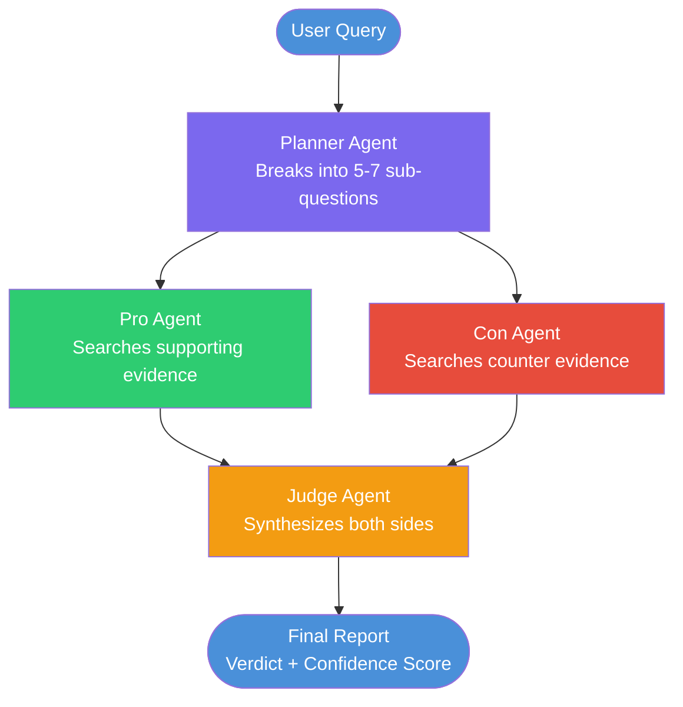

# Debate-Driven Research Agent


> A multi-agent deep research system where opposing agents argue both sides of a topic, and an impartial judge delivers an evidence-based verdict with confidence scoring.

**Not a RAG pipeline.** This is a stateful agentic workflow with planning, parallel execution, and adversarial synthesis.

---

## How It Works



### What makes this different from RAG

| Feature | Standard RAG | This Project |
|---|---|---|
| Query handling | Single retrieval | Planner breaks into sub-questions |
| Perspective | One-sided | Pro + Con agents run in parallel |
| Self-check | None | Judge evaluates both arguments |
| Output | Direct answer | Structured report with confidence score |
| Research depth | Single pass | Multi-step, iterative |

---

## Tech Stack

| Layer | Tool | Purpose |
|---|---|---|
| Orchestration | LangGraph 0.2+ | Stateful graph, parallel nodes |
| LLM | DeepSeek-V3 | Free, GPT-4 level reasoning |
| Web Search | Tavily API | High-quality retrieval |
| API | FastAPI | REST endpoint |
| UI | Streamlit | Demo interface |
| Runtime | Python 3.11+ | Core language |

---

## Project Structure

```
debate-research-agent/
├── src/
│   ├── agents/
│   │   ├── planner.py       # Query → sub-questions
│   │   ├── pro_agent.py     # Evidence FOR
│   │   ├── con_agent.py     # Evidence AGAINST
│   │   └── judge.py         # Verdict + confidence
│   ├── tools/
│   │   └── search.py        # Tavily web search tool
│   ├── graph/
│   │   ├── state.py         # AgentState TypedDict
│   │   └── workflow.py      # LangGraph graph
│   ├── api/
│   │   └── main.py          # FastAPI app
│   └── ui/
│       └── app.py           # Streamlit frontend
├── tests/
├── AGENTS.md                # Instructions for AI coding agents
├── .env.example
├── requirements.txt
└── run.py                   # CLI entry point
```

---

## Quickstart

### 1. Clone and install

```bash
git clone https://github.com/YOUR_USERNAME/debate-research-agent
cd debate-research-agent
python -m venv venv
source venv/bin/activate        # Windows: venv\Scripts\activate
pip install -r requirements.txt
```

### 2. Set environment variables

```bash
cp .env.example .env
```

```env
DEEPSEEK_API_KEY=your_key       # platform.deepseek.com — free
DEEPSEEK_BASE_URL=https://api.deepseek.com
TAVILY_API_KEY=your_key         # tavily.com — free tier
```

### 3. Run

```bash
# CLI — single query
python run.py --query "Is remote work better than office work for productivity?"

# API server
uvicorn src.api.main:app --reload

# Streamlit demo
streamlit run src/ui/app.py
```

### Example output

```
Query: "Is remote work better than office work for productivity?"

PRO (3 sources found):
  Stanford study: remote workers 13% more productive
  Microsoft report: async work reduces meeting overhead by 40%
  ...

CON (3 sources found):
  MIT study: collaboration suffers without in-person contact
  HBR: onboarding and mentorship harder remotely
  ...

VERDICT: Evidence slightly favors remote work for individual tasks,
but office environment wins for collaborative and creative work.

CONFIDENCE: 0.71 / 1.0
STRONGER SIDE: Pro (individual productivity)
UNRESOLVED: Long-term career growth, team cohesion data inconclusive
```

---

## Agent Architecture (Deep Dive)

### State object — shared across all agents

```python
class AgentState(TypedDict):
    query: str
    sub_questions: list[str]
    pro_evidence: list[dict]      # [{source, content, url}]
    con_evidence: list[dict]
    pro_argument: str
    con_argument: str
    verdict: str
    confidence_score: float        # 0.0 — 1.0
    final_report: str
    messages: Annotated[list, add_messages]
```

### LangGraph workflow — parallel execution

```python
# Pro and Con agents run in parallel using Send API
def route_to_researchers(state: AgentState):
    return [
        Send("pro_research", state),
        Send("con_research", state)
    ]

graph.add_conditional_edges("planner", route_to_researchers)
graph.add_edge("pro_research", "judge")
graph.add_edge("con_research", "judge")
```

### Judge agent — structured output

```python
# Judge receives both arguments and returns structured verdict
{
  "verdict": "...",
  "confidence_score": 0.71,
  "stronger_side": "pro",
  "key_uncertainties": ["long-term data missing", "sample size small"]
}
```

---

## API Reference

### POST `/research`

```bash
curl -X POST http://localhost:8000/research \
  -H "Content-Type: application/json" \
  -d '{"query": "Is coffee good for health?"}'
```

**Response:**
```json
{
  "verdict": "...",
  "confidence_score": 0.78,
  "stronger_side": "pro",
  "final_report": "# Research Report\n..."
}
```

### GET `/health`
```json
{"status": "ok"}
```

---

## Research Paper Angle

This project opens a direct research question:

> *"Can adversarial multi-agent debate reduce hallucination and improve factual accuracy in LLM-based research systems?"*

Evaluation plan:
- Benchmark: TruthfulQA dataset
- Compare: single-agent RAG vs debate-agent accuracy
- Metric: factual precision, confidence calibration
- Output: short paper → ML4H / NeurIPS workshop submission

---

## Roadmap

- [x] Core planner → pro/con → judge pipeline
- [x] Parallel agent execution with LangGraph Send API
- [x] Confidence scoring in verdict
- [ ] Source credibility weighting
- [ ] Contradiction detection between sources
- [ ] LangSmith tracing integration
- [ ] Docker deployment
- [ ] Evaluation benchmark on TruthfulQA

---

## Contributing

PRs welcome. Please open an issue first to discuss major changes.

---

## License

MIT

---

*Built by [Nikhil Kumar](https://linkedin.com/in/nikhil-kumar-b7591a240) — IIIT Lucknow | Medical AI Safety Researcher | PhD 2027 target*
